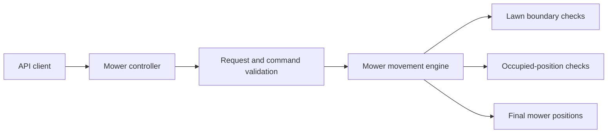

# MowItNow

A Java service that simulates autonomous mowers moving across a bounded lawn
without colliding. It supports structured JSON requests and the classic
line-oriented mower challenge format.

## Flow



## Technology

- Java 21
- Spring Boot 4.1.1
- Gradle 9.7.1 with distribution checksum verification
- springdoc OpenAPI 3.1
- JUnit 5
- Docker and GitHub Actions

## Run

```bash
./moveitnow/gradlew -p moveitnow bootRun
```

Swagger UI is available at `http://localhost:8080/swagger-ui/index.html` and the
OpenAPI description at `http://localhost:8080/v3/api-docs`.

## APIs

`POST /api/mow-string` accepts the classic text format:

```text
5 5
1 2 N
LFLFLFLFF
3 3 E
FFRFFRFRRF
```

The result is:

```text
1 3 N
5 1 E
```

`POST /api/mow` accepts structured JSON:

```json
{
  "lawnField": {"width": 5, "height": 5},
  "moveItCommandList": [
    {
      "mower": {"positionX": 1, "positionY": 2, "direction": "N"},
      "commands": "LFLFLFLFF"
    }
  ]
}
```

Directions must be `N`, `E`, `S`, or `W`; commands may contain only `L`, `R`,
and `F`. Invalid input returns HTTP 400 with a stable JSON error object.

## Verify

```bash
./moveitnow/gradlew -p moveitnow --no-daemon clean test
docker build -t mow-it-now .
```

GitHub Actions runs both checks on the modernization branch and pull requests.

## Scope

The simulation is stateless and in-memory. Authentication, persistence,
distributed coordination, and production deployment are intentionally outside
the current scope.
